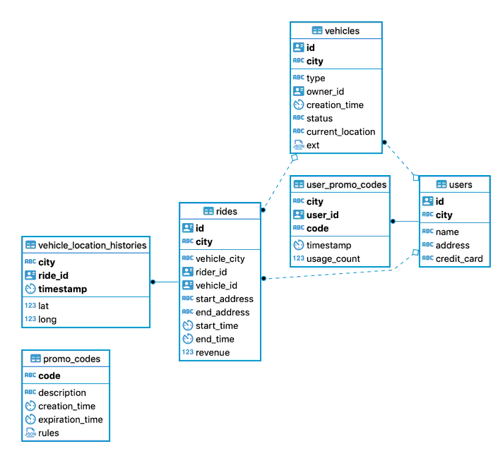

# Demo showing the use of CockroachDB changefeeds (CDC) with CedarDB

Offload the analytical query workload to CedarDB!



TODO: based on this ERD, come up with a few nice analytical queries we can run.

## CockroachDB

```bash
cockroach workload init movr "postgresql://root@localhost:26257?sslcert=$HOME/certs/client.root.crt&sslkey=$HOME/certs/client.root.key&sslmode=verify-full&sslrootcert=$HOME/certs/ca.crt"
```

## CedarDB

```sql
CREATE TABLE public.users
(
	id UUID NOT NULL,
	city VARCHAR NOT NULL,
	name VARCHAR NULL,
	address VARCHAR NULL,
	credit_card VARCHAR NULL,
	PRIMARY KEY (city, id)
);

CREATE TABLE public.vehicles
(
	id UUID NOT NULL,
	city VARCHAR NOT NULL,
	type VARCHAR NULL,
	owner_id UUID NULL,
	creation_time TIMESTAMP NULL,
	status VARCHAR NULL,
	current_location VARCHAR NULL,
	ext JSONB NULL,
	PRIMARY KEY (city, id)
);

CREATE TABLE public.rides
(
	id UUID NOT NULL,
	city VARCHAR NOT NULL,
	vehicle_city VARCHAR NULL,
	rider_id UUID NULL,
	vehicle_id UUID NULL,
	start_address VARCHAR NULL,
	end_address VARCHAR NULL,
	start_time TIMESTAMP NULL,
	end_time TIMESTAMP NULL,
	revenue DECIMAL(10,2) NULL,
	PRIMARY KEY (city, id)
);

CREATE TABLE public.vehicle_location_histories
(
	city VARCHAR NOT NULL,
	ride_id UUID NOT NULL,
	"timestamp" TIMESTAMP NOT NULL,
	lat FLOAT8 NULL,
	long FLOAT8 NULL,
	PRIMARY KEY (city, ride_id, "timestamp")
);

CREATE TABLE public.promo_codes
(
	code VARCHAR NOT NULL,
	description VARCHAR NULL,
	creation_time TIMESTAMP NULL,
	expiration_time TIMESTAMP NULL,
	rules JSONB NULL,
	PRIMARY KEY (code)
);

CREATE TABLE public.user_promo_codes
(
	city VARCHAR NOT NULL,
	user_id UUID NOT NULL,
	code VARCHAR NOT NULL,
	"timestamp" TIMESTAMP NULL,
	usage_count INT8 NULL,
	PRIMARY KEY (city, user_id, code)
);
```

## Start the CDC webhook endpoint

For the time being, [startup.sh](./startup.sh) will need to be edited to align to your
environment.  This will all be put into Docker Compose at some point to simplify all of
it.

```bash
./startup.sh
```

## CockroachDB

```sql
CREATE CHANGEFEED FOR TABLE public.users
INTO 'webhook-https://localhost:8443/cdc/city,id?insecure_tls_skip_verify=true'
WITH updated;

CREATE CHANGEFEED FOR TABLE public.vehicles
INTO 'webhook-https://localhost:8443/cdc/city,id?insecure_tls_skip_verify=true'
WITH updated;

CREATE CHANGEFEED FOR TABLE public.rides
INTO 'webhook-https://localhost:8443/cdc/city,id?insecure_tls_skip_verify=true'
WITH updated;

CREATE CHANGEFEED FOR TABLE public.vehicle_location_histories
INTO 'webhook-https://localhost:8443/cdc/city,ride_id,timestamp?insecure_tls_skip_verify=true'
WITH updated;

CREATE CHANGEFEED FOR TABLE public.promo_codes
INTO 'webhook-https://localhost:8443/cdc/code?insecure_tls_skip_verify=true'
WITH updated;

CREATE CHANGEFEED FOR TABLE public.user_promo_codes
INTO 'webhook-https://localhost:8443/cdc/city,user_id,code?insecure_tls_skip_verify=true'
WITH updated;
```

## Start the Movr app

```bash
cockroach workload run movr "postgresql://root@localhost:26257?sslcert=$HOME/certs/client.root.crt&sslkey=$HOME/certs/client.root.key&sslmode=verify-full&sslrootcert=$HOME/certs/ca.crt"
```

