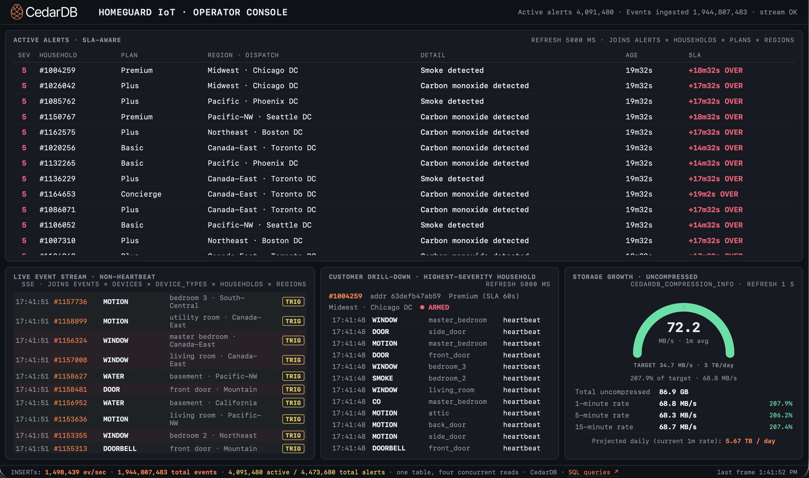

# HomeGuard IoT — CedarDB Operator Console



A small Go project that simulates an alarm-monitoring company's IoT
backplane and showcases CedarDB serving both the OLTP-style operator
console *and* the OLAP-style ingest-rate analytics off the same table at
the same time.

The pitch: a customer running ~3-4 TB/day of incoming sensor events is
almost certainly running two stacks today — BigQuery for offline analytics
plus some streaming pipeline (Pub/Sub + Dataflow + a KV store) for the
monitoring center operators. This demo collapses both onto a single
CedarDB instance, with a multi-table normalized schema that lets the
dashboard run real joins instead of operating over pre-denormalized flat
tables.

## Talking points for the demo

- This is one database. The operator queue, the live event stream, the
  drill-down, the footer ingest counters, and the storage growth gauge
  all read against the same `events` table while the simulator is
  writing to it at hundreds of thousands of rows/sec — the `-rate` knob
  goes from 2,500 (gentle demo) to 1,500,000+ (driving toward the
  3 TB/day target on real hardware).

- Today you'd run BigQuery for the aggregates and Pub/Sub → Dataflow →
  Bigtable for the operator console. Two pipelines, two SLAs, one ETL
  step in between with replication lag measured in seconds-to-minutes.

- Notice the joins — Plan tier determines SLA, dispatch center comes
  from Region, device code comes from the catalog. BigQuery prefers
  denormalized flat tables; CedarDB does these joins on hot data without
  flinching.

## What's inside

```
schema.sql                  -- canonical reference (see internal/db/)
docker-compose.yml          -- CedarDB + simulator + dashboard
Dockerfile                  -- builds both Go binaries (CMD, not ENTRYPOINT!)
cmd/simulator/main.go       -- drives the event stream
cmd/server/main.go          -- serves the operator dashboard
internal/db/                -- connection pool + embedded schema bootstrap
internal/sim/               -- catalog data, fleet synthesis, alert rules
internal/web/               -- HTTP server, SSE + HTMX, embedded UI assets
```

## Schema (8 tables, real joins)

```
plans            (dimension)   monthly_price, sla_seconds
regions          (dimension)   dispatch center + timezone
device_types     (dimension)   MOTION, DOOR, SMOKE, CO, WATER, ...
households       (dimension)   plan_id + region_id; armed/disarmed
devices          (dimension)   one row per sensor; FK to household + type
events           (HOT)         100 K+ rows/sec sustained; the firehose
alerts           (HOT, small)  derived from triggered events via rules
storage_samples  (telemetry)   (sampled_at, uncompressed_bytes) per
                               HG_STORAGE_SAMPLER_INTERVAL; drives the
                               dashboard growth gauge
```

`events.event_id` is a plain `BIGINT` (not `BIGSERIAL`) — the simulator
allocates IDs from an in-process `atomic.Int64` so it can keep the hot
write path on `pgx.CopyFrom`. CedarDB rejects the binary `COPY` frame
when the destination column carries a sequence default ("unable to
cast from void to bigint"), and we never wanted the round trip a
server-side sequence would imply.

Indexes are sized for the join-heavy reads: `alerts (status, raised_at
DESC)`, `events (household_id, ts DESC)`, `events (kind, ts DESC)`.
See `internal/db/schema.sql` for the full list.

## Run it (Docker)

```
docker compose up --build
# open http://localhost:8080
```

Three containers come up: `hg-cedardb` (the database), `hg-simulator` (the
data generator), and `hg-server` (the dashboard). The simulator embeds
`schema.sql` and applies it automatically on first run.

The simulator logs every DDL statement it runs and prints its target
event rate; you should see something like:

```
hg-simulator | … connected to CedarDB
hg-simulator | … schema-presence probe: households table missing
hg-simulator | … applying schema: 15 statements
hg-simulator | …   [ 1/15] CREATE TABLE IF NOT EXISTS plans … — ok
…
hg-simulator | … synthesized fleet: 30000 households · 297218 devices
hg-simulator | … event_id counter seeded at 0
hg-simulator | … storage sampler: interval=5s
hg-simulator | … ingestor: batchSize=10000 flushInterval=50ms
hg-simulator | … simulator running: writers=8 tickHz=10 target=2500 ev/s hb/tick/writer=31 fleet=297218 devices · ingestors=1 batch=10000 flush=50ms
hg-simulator | … heartbeat: queue=0/64 eventID=24320 delta=2432 rows/s lastCopy=12ms ago copyFails=0
hg-server    | … dashboard listening on :8080
```

If you need a clean slate (drop all tables and re-create), the simulator
takes `-reset-schema`:

```
docker compose run --rm simulator /app/simulator -reset-schema
docker compose up
```

## Dashboard layout

```
┌────────────────────────────────────────────────────────────────────────────┐
│ ACTIVE ALERTS · SLA-aware              refresh HG_ALERTS_REFRESH (1s)      │
│ ┌────────────────────────────────────────────────────────────────────────┐ │
│ │ SEV · HH · PLAN · REGION / DC · DETAIL · AGE · SLA REMAINING           │ │
│ │  5  #1024131  Premium  Atlanta DC  SMOKE detected         12 s   18 s  │ │
│ │  4  #1009823  Plus     Boston DC   GLASS_BREAK            03 s   57 s  │ │
│ │  …                                                                     │ │
│ └────────────────────────────────────────────────────────────────────────┘ │
├──────────────────────┬──────────────────────┬──────────────────────────────┤
│ LIVE EVENT STREAM    │ CUSTOMER DRILL-DOWN  │ STORAGE GROWTH               │
│ SSE HG_SSE_INTERVAL  │ HG_DRILLDOWN_REFRESH │ HG_STORAGE_REFRESH (1s)      │
│ (200 ms)             │ (2s · auto-rotates)  │                              │
│                      │                      │       ╭───────────╮          │
│ 15:42:08 SMOKE  kit. │ #1019823  Premium    │       │   25.3    │  MB/s    │
│ 15:42:07 MOTION hall │ ● ARMED              │       ╰───────────╯  1m avg  │
│ 15:42:06 DOOR   front│ ──────────────────── │  target 34.7 MB/s · 3 TB/day │
│ …                    │ 15:42:08 SMOKE kit.  │  total uncompressed 62.0 GB  │
│                      │ 15:42:01 MOTION hall │  1m 25.3 · 5m 23.1 · 15m …   │
└──────────────────────┴──────────────────────┴──────────────────────────────┘
INSERTs: 312,049 ev/sec · 1,251,514,277 total · 1,270,594 active / 2,022,994 alerts
                              one table, five concurrent reads · CedarDB · SQL queries↗
```

Each panel is driven by a different query against the same `events`,
`alerts`, and `storage_samples` tables the simulator is still writing
into. Cadences are configurable per-panel — see *Tuning at runtime*
below.

## The queries that matter

Hit `http://localhost:8080/static/queries.html` once the dashboard is up
for a syntax-highlighted reference of every SQL statement the app runs,
where it lives in the code, and how often it fires. The three to draw
attention to during a demo:

**Active-alerts queue (joins 4 tables, refreshes every `HG_ALERTS_REFRESH`):**

```sql
SELECT a.alert_id, a.severity, a.detail,
       EXTRACT(EPOCH FROM (now() - a.raised_at))::int AS age_s,
       p.sla_seconds,
       p.sla_seconds - EXTRACT(EPOCH FROM (now() - a.raised_at))::int AS sla_remaining,
       h.household_id, h.address_hash,
       p.name AS plan_name,
       r.name AS region_name, r.dispatch_center
FROM   alerts a
JOIN   households h ON h.household_id = a.household_id
JOIN   plans      p ON p.plan_id      = h.plan_id
JOIN   regions    r ON r.region_id    = h.region_id
WHERE  a.status = 'active'
ORDER  BY a.severity DESC, a.raised_at ASC
LIMIT  25
```

**Live event stream (joins 5 tables, server-pushed every `HG_SSE_INTERVAL`):**

```sql
SELECT e.event_id, e.ts, e.household_id, h.address_hash,
       dt.code, d.location, e.kind, e.severity,
       COALESCE(e.battery_pct, -1), r.name
FROM   events e
JOIN   devices       d  ON d.device_id      = e.device_id
JOIN   device_types  dt ON dt.device_type_id = d.device_type_id
JOIN   households    h  ON h.household_id   = e.household_id
JOIN   regions       r  ON r.region_id      = h.region_id
WHERE  e.kind > 0
ORDER  BY e.ts DESC
LIMIT  25
```

**Live ingest rate (the meta-query, refreshes every `HG_STATS_REFRESH`):**

The footer's events/sec and total-events counters come from
`storage_samples` — *not* from a `COUNT(*)` over a billion-row events
table. The simulator writes `(now(), 48 × eventID)` into
`storage_samples` every `HG_STORAGE_SAMPLER_INTERVAL` from its
in-process atomic counter, so the two most recent rows give both the
size and the rate without ever scanning the hot table.

```sql
SELECT
    (SELECT uncompressed_bytes FROM storage_samples
         ORDER BY sampled_at DESC LIMIT 1) AS latest_bytes,
    (SELECT sampled_at         FROM storage_samples
         ORDER BY sampled_at DESC LIMIT 1) AS latest_ts,
    (SELECT uncompressed_bytes FROM storage_samples
         WHERE sampled_at < (SELECT MAX(sampled_at) FROM storage_samples)
         ORDER BY sampled_at DESC LIMIT 1) AS prior_bytes,
    (SELECT sampled_at         FROM storage_samples
         WHERE sampled_at < (SELECT MAX(sampled_at) FROM storage_samples)
         ORDER BY sampled_at DESC LIMIT 1) AS prior_ts;
-- total_events = latest_bytes / 48
-- rows_per_sec = (latest_bytes - prior_bytes) / dt / 48
```

The published `rows_per_sec` is therefore an average over the sampler
interval (default 5 s), not a strict 1-second window.

## Knobs

```
docker compose run --rm simulator /app/simulator \
    -households 50000 \
    -devices-per-household 12 \
    -rate 5000 \
    -hz 20 \
    -writers 8
```

`-rate` sets the sustained events/sec target (heartbeats + triggered).
`-hz` sets the simulator's tick rate; higher Hz = smoother bursts but
more network round-trips. `-writers` is the number of producer
goroutines that partition the device fleet and generate rows in
parallel; they hand off to a single ingestor goroutine that runs
`CopyFrom` against CedarDB. The fleet sizing knobs control how many
`households` and `devices` rows get synthesized on startup.

## Tuning at runtime

Most dashboard cadences and a few pipeline knobs are configurable via
`HG_*` environment variables in `docker-compose.yml`. Defaults match
the original hardcoded values, so leaving everything unset preserves
the standard demo behaviour. All durations are Go duration strings
(`200ms`, `1s`, `30s`, `1m30s`).

### Dashboard refresh cadences (server container)

| Env var | Default | UI region |
|---|---|---|
| `HG_SSE_INTERVAL` | `200ms` | **Live Event Stream** panel (bottom-left). Server-side SSE push rate — the browser holds one long-lived connection and the server pushes a frame at this interval. The "last frame" timestamp in the bottom-right of the footer tracks this one. |
| `HG_ALERTS_REFRESH` | `1s` | **Active Alerts** queue (top, full-width). htmx polls `/api/alerts`. |
| `HG_DRILLDOWN_REFRESH` | `2s` | **Customer Drill-Down** (bottom-middle). htmx polls `/api/drilldown`. This runs three SQL queries per tick (pick highest-severity household → fetch its plan/region header → fetch its last 20 events), so it's the biggest cost-per-tick and the most useful one to dial down if dashboard load is competing with ingest. |
| `HG_STATS_REFRESH` | `1s` | **Footer counters** *and* the **header counters** ("Active alerts N · Events ingested N"). JS polls `/api/stats`. The only env var that updates two regions at once, so slowing it down has the most visible effect. |
| `HG_STORAGE_REFRESH` | `1s` | **Storage Growth** gauge (bottom-right): the arc, the 1m/5m/15m rate table, the projected-daily figure. The cheapest poll of the bunch — it just reads `storage_samples`, a few hundred rows — so there's rarely a reason to raise this. |

### Pipeline knobs (simulator container)

| Env var | Default | Effect |
|---|---|---|
| `HG_STORAGE_SAMPLER_INTERVAL` | `5s` | How often the simulator writes a row into `storage_samples`. Doesn't drive any UI poll directly, but sets the minimum window over which the gauge can compute a rate — set this to `30s` and the dashboard's 1m/5m/15m rates become 30-second moving averages. Cheap to leave at `5s`. |
| `HG_INGEST_BATCH` | `10000` | Rows the ingestor accumulates before firing one `pgx.CopyFrom`. Bigger → better per-COPY amortization; smaller → lower latency to the live event stream. Watch the heartbeat `lastCopy` and `delta` numbers when tuning. |
| `HG_INGESTORS` | `1` | Number of ingestor goroutines running `CopyFrom` in parallel. Default `1` is safe everywhere — older CedarDB rejected overlapping COPYs with `SQLSTATE 40P01`; newer versions accept concurrent COPYs, in which case `2`, `4`, `8` may give a meaningful throughput bump. If the heartbeat's `queue=CAP/CAP` ceiling drops as you raise this, the single ingestor was the bottleneck and CedarDB can absorb more parallelism. If the queue stays pegged, CedarDB is serializing the work server-side and adding more ingestors won't help. |
| `HG_RESOLVE_INTERVAL` | `2s` | How often the background alert resolver fires. |
| `HG_RESOLVE_AUTOTUNE` | `true` | When on, the resolver picks each tick's LIMIT as `max(floor, ceil(deltaFired × 1.2 + backlog × 0.01))`, capped at 100 K. `deltaFired` and `backlog` are tracked via in-process atomic counters — no `COUNT(*)` on the alerts table needed. Set to `false` to pin the limits at their floors (handy when you want to demo what happens to AGE/SLA as a backlog grows). |
| `HG_RESOLVE_LOW_LIMIT` | `2000` | **Floor** for the per-tick low-severity (1-2) resolver, which marks alerts `false_alarm`. Auto-tune can push higher; without auto-tune this is just the limit. |
| `HG_RESOLVE_HIGH_LIMIT` | `600` | **Floor** for the per-tick high-severity (3+) resolver, which marks alerts `resolved`. High-severity alerts must also have aged at least 20 seconds to be eligible, so they sit in the operator queue long enough to look like real triage work. |

### Reading the simulator heartbeat

Once per second the simulator logs a one-line status report you can use
to triage ingest behaviour. Tail it with `docker logs hg-simulator`:

```
heartbeat: queue=12/64 eventID=1483920475 delta=748520 rows/s lastCopy=12ms ago copyFails=0
```

- **`queue=N/CAP`** — depth of the producer→ingestor channel. Near `CAP` means CedarDB is the bottleneck.
- **`eventID`** — monotonic atomic counter; each row generated bumps it. Doubles as a precise total-rows figure.
- **`delta=N rows/s`** — row generation rate computed from the eventID counter.
- **`lastCopy=Xms ago`** — wall time since the most recent successful `CopyFrom`. Should be under one second when ingest is healthy.
- **`copyFails=N`** — cumulative `CopyFrom` errors since startup. Non-zero means CedarDB is rejecting; the error text appears on the line above the heartbeat.

Three patterns worth recognising:

- `delta=0 queue=0` → producers stopped. Look for goroutine panics in the simulator log.
- `delta=N queue=CAP lastCopy growing` → CedarDB stopped accepting writes. Check `hg-cedardb` logs, disk space, and the compactor.
- `delta=N queue=CAP lastCopy<1s copyFails=0` → healthy steady-state at the write-path cap. To push past it, try larger `HG_INGEST_BATCH` and/or more `HG_INGESTORS`, or move to bigger hardware.

The resolver emits its own status line once every 10 seconds:

```
resolver: drain low=42/2000 high=3187/3825 · backlog low=0 high=14
```

`drain low=X/Y` is "Y rows of low-severity LIMITed, X actually resolved" — when X < Y the queue is empty for that tier; when X = Y the resolver is at the cap. `backlog` is the in-process `(fired − resolved)` estimate; if it climbs steadily, auto-tune is falling behind (rare — the controller's 1% backlog decay is normally enough to keep up).

## Scaling up

The defaults in `docker-compose.yml` are sized for a developer laptop
(~10 cores, 16–32 GB RAM). On real demo hardware — for example a
192-core x86 box with 384 GB RAM — there's a lot of headroom that the
laptop config simply can't use. A reasonable starting point on a box
like that:

```yaml
simulator:
  command: ["/app/simulator",
    "-households=200000",
    "-devices-per-household=12",
    "-rate=2000000",        # 2 M ev/s ≈ 96 MB/s ≈ 8 TB/day uncompressed
    "-hz=20",
    "-writers=64"]
  environment:
    HG_INGESTORS:    "8"        # parallel CopyFroms (requires recent CedarDB)
    HG_INGEST_BATCH: "50000"    # bigger batches amortise the COPY round trip
    HG_STORAGE_SAMPLER_INTERVAL: "5s"
    # Alert generation scales with -writers, but the resolver auto-tunes
    # its LIMITs each tick from the in-process generation rate and
    # backlog, so no manual sizing is needed when you bump -writers.
    # The defaults stay fine. If you'd rather see the queue grow (to
    # demo SLA breach), set HG_RESOLVE_AUTOTUNE=false.
```

The pool's `MaxConns=64` in `internal/db/db.go` will need to grow if
`-writers` × `HG_INGESTORS` plus the dashboard's concurrent reads
exceed it — roughly speaking, set it to `writers + ingestors + 16`.

The heartbeat is your scoreboard while you push the dial up:

- **`delta` rises and `queue` no longer pegs at CAP** as you raise
  `HG_INGESTORS` → the single ingestor was the bottleneck and CedarDB
  can absorb more parallel COPYs.
- **`delta` is flat regardless of `HG_INGESTORS`** → CedarDB is
  serializing the work internally; the next move is `HG_INGEST_BATCH`
  or CedarDB-side tuning.
- **`copyFails > 0`** → CedarDB is rejecting. The error message on the
  preceding log line tells you why (most likely you've raised
  `HG_INGESTORS` past what your CedarDB version allows and gone back
  to the 40P01 territory).

For the dashboard side at higher rates, keep the read cadences honest
about what the queries cost:

```yaml
server:
  environment:
    HG_SSE_INTERVAL:      "200ms"  # joins 5 tables, kind > 0 filter
    HG_ALERTS_REFRESH:    "1s"     # joins 4 tables on the small alerts table
    HG_DRILLDOWN_REFRESH: "2s"     # three queries per tick; the costliest
    HG_STATS_REFRESH:     "1s"     # reads storage_samples only — cheap
    HG_STORAGE_REFRESH:   "1s"     # reads storage_samples only — cheap
```

On a 192-core box these are easily affordable; on a laptop you'll
want to crank them up to give CedarDB more headroom for the write
path.

### Which indexes to keep

There's a real tension between write throughput and dashboard read
latency, but it isn't symmetric across tables:

| Table | Indexes? | Why |
|---|---|---|
| `alerts` | **Keep them.** | The table is in the millions, never billions; index maintenance is trivial. *All four read paths* on the dashboard (queue, drilldown via household, resolver inner SELECT) need them. Without an `(status, raised_at DESC)` index the active-alerts query becomes a multi-million-row scan that the resolver fights with every 2 s, and you'll see the panel intermittently render "no active alerts" because the iteration timed out mid-scan. |
| `events` | **Optional.** Drop if you want to maximise write rate. | One index entry per inserted row at ~30 K/s is real write cost; the dashboard's events queries are all small-LIMIT scans of the recent tail and CedarDB's column store handles them respectably even without the index. The trade-off is that the SSE event-stream panel and the drill-down's per-household scan will be slower at very large table sizes — usually still tolerable. |

If you dropped the alerts indexes during a write-throughput experiment,
put them back before treating the dashboard as canonical:

```sql
CREATE INDEX alerts_status_raised_idx    ON alerts (status, raised_at DESC);
CREATE INDEX alerts_household_raised_idx ON alerts (household_id, raised_at DESC);
```

### When a panel intermittently shows empty

The dashboard handlers now log `rows.Err()` after each iteration, so a
mid-scan context cancellation no longer looks identical to an empty
result. If you see "no active alerts" in the panel, check the server
container's logs:

```
docker logs hg-server 2>&1 | grep "rows.Err"
```

A non-empty stream of `context canceled` or `deadline exceeded` lines
means the underlying SQL is taking long enough that requests are
aborting before it returns. The fix is almost always either to add the
missing index for that query or to lower the polling frequency.

