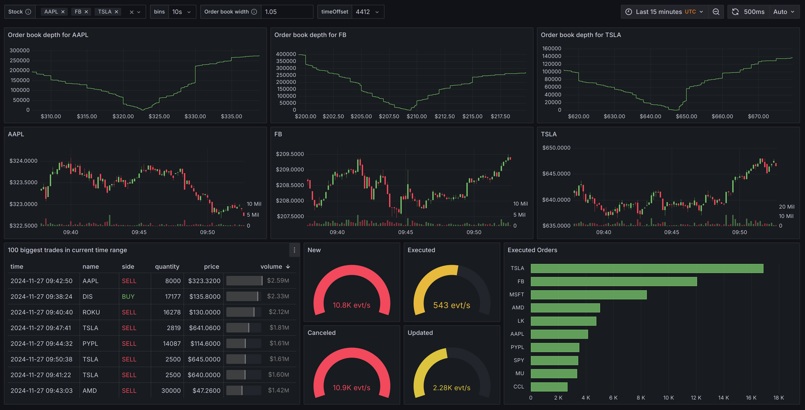
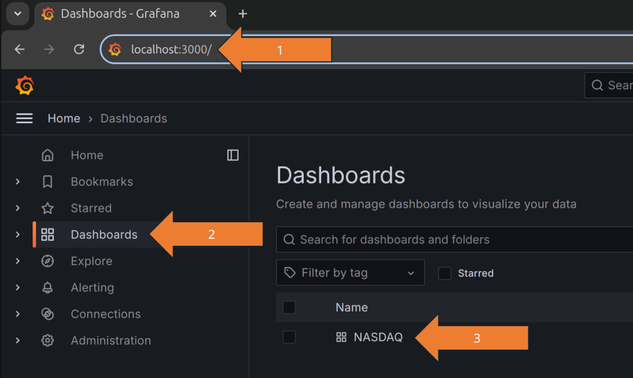

# Replaying the NASDAQ order book

This example live-replays the complete NASDAQ order stream from January 30, 2020, with CedarDB. For dataset background, see [the NASDAQ example dataset docs](https://cedardb.com/docs/example_datasets/nasdaq/).

What's especially noteworthy here is that CedarDB is not only running the **transactional query workload**,
inserting thousands of events every 100 ms, but also the **complex analytical queries** which feed the various
views in the Grafana dashboard. It's an excellent illustration of the power of Hybrid Transactional/Analytical
Processing (HTAP).



The setup is fully dockerized. The demo stack contains:

1. `parser`: downloads the NASDAQ ITCH dump and converts it into CSV files.
2. `cedar`: runs CedarDB and stores the parsed data on a Docker volume.
3. `client`: creates the schema, loads reference and pre-market data, and replays the live market stream in 100 ms batches.
4. `grafana`: shows live analytics on top of the replay.
5. `aichat`: optional web UI for natural-language questions over the same database.

In comparison mode, the stack also starts PostgreSQL and replays the same workload into both databases.

## Getting started

Prerequisites:

1. Docker with Compose support.
2. A stable internet connection to pull the required Docker images and download the NASDAQ dataset on first run.

Optional:

1. A CedarDB license at `db-config/cedar/license.env`. You can sign up for a trial at https://console.cedardb.com/signup.

The license is needed to create the dedicated `grafana` database user and grant the required user permissions cleanly. It also enables database statistics in comparison mode.

If no license is present, `demo.sh` falls back to using the `postgres` admin user for Grafana access because the dedicated `grafana` user cannot be granted the required read permissions.

## Run the demo

Use `demo.sh` as the entrypoint for the stack:

```shell
./demo.sh start
```

This starts the normal stack in the background with `docker compose up -d --build`. On the first run, the parser container:

1. downloads the NASDAQ archive, about 3.3 GB compressed,
2. extracts it,
3. parses it into roughly 16 GB of CSV data,
4. stores everything in the Docker volume `data`.

Depending on your connection and machine, the initial download and parsing step can take around 10 to 15 minutes.

After the parser finishes, the client loads the schema and pre-market data, then begins the timed replay. The replay starts 10 minutes after market open, so the initial database state corresponds to 9:40 AM market time. If it has been running for 20 minutes, the database state represents 10:00 AM market time.

Useful lifecycle commands:

```shell
./demo.sh stop  # Stop and remove all containers
./demo.sh clean # Stop and remove all containers, then remove Docker volumes, including the parsed dataset
./demo.sh pull  # Pull the latest database images
```

## Access the Dashboard

Grafana is exposed on http://localhost:3000.

Authentication is disabled for the UI, so opening the page is enough. The dashboard is provisioned automatically.



## Access the AI Chat

The AI chat UI is exposed on http://localhost:8080.

By default, the container starts with:

```shell
OPENROUTER_API_KEY={your_api_key_here}
LLM_MODEL=anthropic/claude-sonnet-4.5
```

Set `OPENROUTER_API_KEY` before `./demo.sh start` if you want the chat UI to be functional.

## Query the data

The best way to run ad hoc SQL in this setup is through Grafana Explore.

Open http://localhost:3000/explore, select the provisioned PostgreSQL-compatible data source, and run SQL directly there.

Example queries:

```sql
select count(*) from orders;
select avg(price) from executions;
```

The following query calculates new orders per second averaged over the last 10 seconds:

```sql
select count(*) / 10 as new
from orders o
where prevOrder is null
  and o.timestamp > (
    select max(e.timestamp) from executions e
  ) - 10::bigint * 1000 * 1000 * 1000;
```

More analytical queries are available in [`sql/`](./sql).

If you prefer other database tools like psql or DBeaver, expose the database port (5432) to localhost in `compose.yml`/`comparison.compose.yml`.

## Comparison mode

Comparison mode starts CedarDB and PostgreSQL with the same CPU and memory limits, then replays the same workload into both systems.

It requires `DB_CPU_LIMIT` and `DB_MEM_LIMIT`:

```shell
DB_CPU_LIMIT=4 DB_MEM_LIMIT=8g ./demo.sh --comparison start
```
