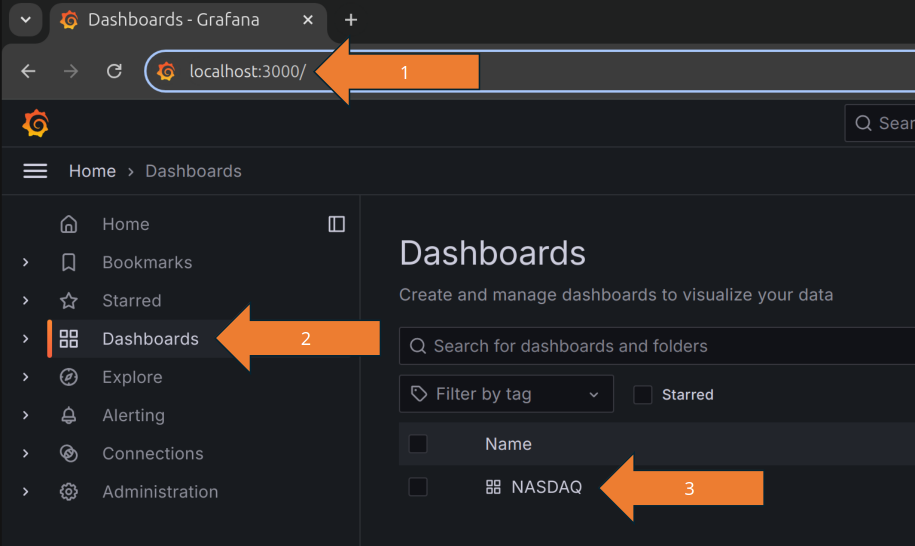

# Replaying the NASDAQ order book

This is an example project live-replaying the complete NASDAQ exchange orders from January 30 2020 with CedarDB.
For an overview of the dataset, take a look at [our example dataset docs](https://cedardb.com/docs/example_datasets/nasdaq/).

What's especially noteworthy here is that CedarDB is not only running the **transactional query workload**,
inserting thousands of events every 100 ms, but also the **complex analytical queries** which feed the various
views in the Grafana dashboard.  It's an excellent illustration of the power of Hybrid Transactional/Analytical
Processing (HTAP).

This example consists of separate applications:

1. A parser written in Python that parses NASDAQ's proprietary ITCHv5 protocol into human-readable CSV files.
2. A C++ client connecting to CedarDB and live-replaying all orders.
3. A Grafana Dashboard displaying live analytics (pictured below).


In addition to Grafana, you can also issue queries yourself to get insight into the market state.
This guide will show you how to do both using `docker compose`.


## Getting started

This guide assumes you already have a cedardb docker image, i.e. have completed [this guide](https://cedardb.com/docs/getting_started/running_docker_image/) up to step two.

### 1. Prepare the data 
Execute the `prepare.sh` script:
```shell
./prepare.sh
```
It downloads the raw binary package capture that NASDAQ provides, extracts it and transforms it into CSV files.
This downloads about 3.3 GB and writes ~16 GB CSV files.

You should now have a set of files in the data directory containing the stock exchange events:

```shell
du -h data/*.csv
```

```
5,3G	data/cancellations.csv
181M	data/cancellationsPreMarket.csv
337M	data/executions.csv
2,7M	data/executionsPreMarket.csv
7,5M	data/marketMakers.csv
9,8G	data/orders.csv
279M	data/ordersPreMarket.csv
516K	data/stocks.csv
```

### 2. Run the application
```shell
docker compose build client
docker compose up
```

While the client is running, it replays the live exchange data in 100ms batches, treating the point in time the program was started as 9:30 AM, i.e. the exact instance the market opens.
In the first minute, the client catches up to the live transaction stream and starts inserting many events.
Afterward, you should get batches of a couple of thousand events per 100ms.
So, if you run the client for 30 minutes, the database state will represent the state of the NASDAQ exchange 30 minutes after market open, i.e., 10:00 AM.


You can stop the application via `CTRL+C` followed by `docker compose down`

### 3. Connect to Grafana
You can now browse to Grafana at http://localhost:3000, log in with username `admin` and password `admin`, and view the NASDAQ dashboard.




### 4. Query the data
Alternatively, you can run your own queries.  This requires installation of the `psql` PostgreSQL command line interface.
Note that, for the `Time:` values to appear, you need to either run `\timing on` from within the session or
have a `$HOME/.psqlrc` file containing at least the following line: `\timing on`.

```shell
PGPASSWORD=postgres psql -h localhost -U postgres -d postgres
```

Here are some example queries to get you started:

```sql
postgres=#
select count(*) from orders;
  count   
----------
 11019259
(1 row)

Time: 5.316 ms
```

```sql
postgres=#
select avg(price) from executions;
             avg             
-----------------------------
 140.21785151844912886904428
(1 row)

Time: 15.681 ms
```

The following query calculates the new orders created per second averaged over the last 10 seconds.

```sql
client=#
select count(*) / 10 as new -- averaged over 10 seconds
from  orders o
where prevOrder is null -- == new order
and o.timestamp > (select max(e.timestamp) from executions e) - 10::bigint * 1000 * 1000 * 1000; -- averaged over 10 seconds
 new  
------
 8285
(1 row)

Time: 32.514 ms
```

You can find some more complex queries in the `sql` subdirectory.

## Load everything

Start the Docker image, mounting the `./data` directory containing the CSV data:

```shell
docker run --rm -p 5432:5432 -e CEDAR_PASSWORD=postgres -v ./data:/data --name cedardb cedardb
```

Connect to CedarDB via the `psql` CLI:

```shell
PGPASSWORD=postgres psql -h localhost -U postgres -d postgres
```

Using the `psql` client, run the DDL and then directly copy the CSV data:

```sql
\i client/schema.sql
copy stocks from '/data/stocks.csv' with(format text, delimiter ';', null '', header true);
copy marketmakers from '/data/marketMakers.csv' with(format text, delimiter ';', null '', header true);
copy orders from '/data/ordersPreMarket.csv' with(format text, delimiter ';', null '', header true);
copy orders from '/data/orders.csv' with(format text, delimiter ';', null '', header true);
copy executions from '/data/executionsPreMarket.csv' with(format text, delimiter ';', null '', header true);
copy executions from '/data/executions.csv' with(format text, delimiter ';', null '', header true);
copy cancellations from '/data/cancellationsPreMarket.csv' with(format text, delimiter ';', null '', header true);
copy cancellations from '/data/cancellations.csv' with(format text, delimiter ';', null '', header true);
```

Try running some ad hoc SQL queries.

Please note that this does not maintain the orderbook, which would be maintained by the client.

